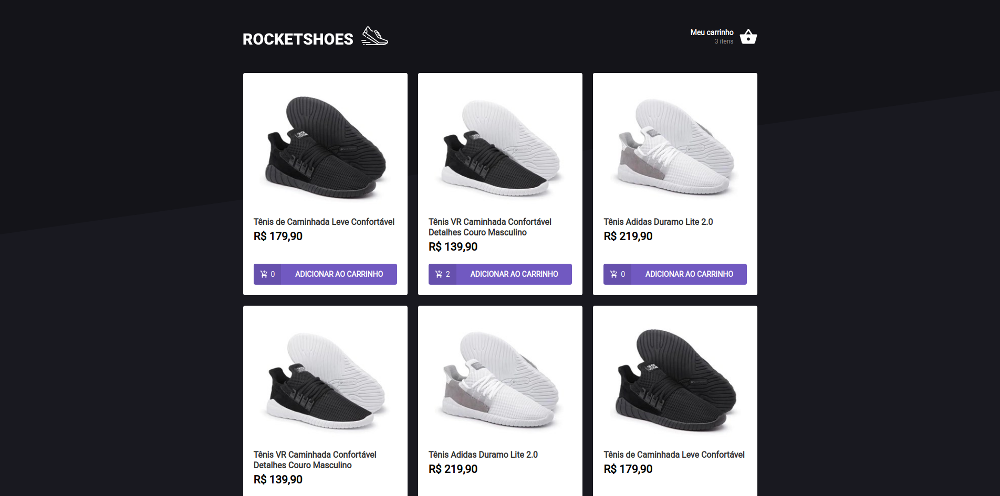

  
  
      

 

  

<h3 align="center">
  Desafio 03 - Trilha ReactJS
</h2>

	Resolução do Desafio "Criando um hook de carrinho de compras"

## Sobre o desafio

  

Nesse desafio, você deverá criar uma aplicação para treinar o que aprendeu até agora no ReactJS

Essa será uma aplicação onde o seu principal objetivo é criar um hook de carrinho de compras. Você terá acesso a duas páginas, um componente e um hook para implementar as funcionalidades pedidas nesse desafio:

- Adicionar um novo produto ao carrinho;
- Remover um produto do carrinho;
- Alterar a quantidade de um produto no carrinho;
- Cálculo dos preços sub-total e total do carrinho;
- Validação de estoque;
- Exibição de mensagens de erro;
- Entre outros.

## Status do desafio

✅ Completo